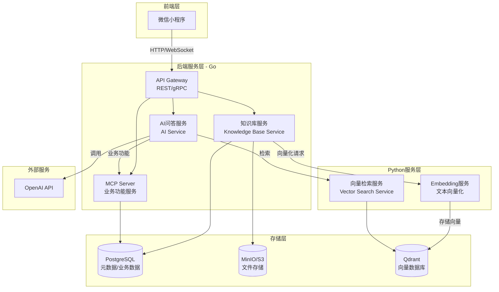
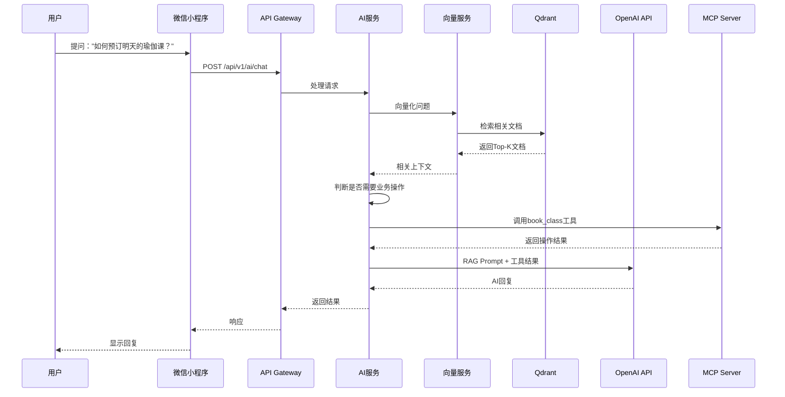

# 知识库系统与微信小程序开发计划

## 系统架构概览

系统采用微服务架构，包含以下核心组件：




## 项目结构

```javascript
yoga/
├── cmd/
│   ├── api-server/          # API Gateway入口
│   ├── kb-service/          # 知识库服务入口
│   └── mcp-server/          # MCP Server入口
├── internal/
│   ├── api/                 # HTTP/gRPC处理程序
│   │   ├── handler/         # 请求处理
│   │   └── middleware/      # 中间件（认证、追踪等）
│   ├── service/             # 业务逻辑层
│   │   ├── knowledge/       # 知识库服务
│   │   ├── ai/              # AI问答服务
│   │   └── booking/         # 定课业务服务
│   ├── repository/          # 数据访问层
│   │   ├── postgres/        # PostgreSQL实现
│   │   └── qdrant/          # Qdrant客户端
│   ├── domain/              # 领域模型
│   │   ├── knowledge/       # 知识库领域
│   │   ├── ai/              # AI问答领域
│   │   └── booking/         # 定课领域
│   └── config/              # 配置管理
├── pkg/
│   ├── storage/             # 文件存储抽象
│   ├── mcp/                 # MCP协议实现
│   └── observability/       # OpenTelemetry工具
├── python/
│   ├── vector_service/      # 向量检索服务
│   │   ├── app.py           # FastAPI应用
│   │   └── services/        # 检索逻辑
│   └── embedding_service/   # Embedding服务
│       ├── app.py
│       └── models/          # 模型加载
├── miniprogram/             # 微信小程序
│   ├── pages/               # 页面
│   │   ├── booking/        # 定课页面
│   │   └── chat/           # AI问答页面
│   ├── components/          # 组件
│   └── utils/               # 工具函数
├── configs/                 # 配置文件
├── deployments/             # 部署配置（Docker/K8s）
└── test/                    # 测试工具
```


## 核心功能模块

### 1. 知识库服务（Go）

**职责**：

- 知识库CRUD操作
- 多类型内容上传（文本、图片、视频）
- 内容预处理和元数据提取
- 触发向量化任务

**关键文件**：

- `internal/service/knowledge/service.go` - 知识库业务逻辑
- `internal/repository/postgres/knowledge.go` - 数据访问
- `internal/domain/knowledge/entity.go` - 领域模型

**数据模型**：

- KnowledgeBase（知识库）
- KnowledgeItem（知识项：文本/图片/视频）
- FileMetadata（文件元数据）

### 2. 向量检索服务（Python）

**职责**：

- 文本向量化（调用embedding模型）
- 向量存储到Qdrant
- 相似度检索
- 多模态支持（图片、视频的向量化）

**技术栈**：

- FastAPI
- sentence-transformers / OpenAI embeddings
- Qdrant Python客户端

**关键文件**：

- `python/vector_service/app.py` - API服务
- `python/embedding_service/app.py` - Embedding服务

### 3. AI问答服务（Go）

**职责**：

- 接收用户问题
- 从知识库检索相关内容（调用向量服务）
- 构建Prompt（知识库内容 + 用户问题）
- 调用OpenAI API
- 集成MCP Server处理业务功能（如定课）

**关键文件**：

- `internal/service/ai/service.go` - AI问答逻辑
- `internal/service/ai/retriever.go` - 知识库检索
- `internal/service/ai/prompt_builder.go` - Prompt构建

**流程**：

1. 用户提问 → 向量化问题
2. 向量检索 → 获取Top-K相关文档
3. 构建RAG Prompt → 调用OpenAI
4. 如果涉及业务操作 → 调用MCP Server

### 4. MCP Server（Go）

**职责**：

- 实现MCP协议
- 提供业务功能工具（如定课、查询课程等）
- 可扩展的工具注册机制

**关键文件**：

- `internal/mcp/server.go` - MCP Server实现
- `internal/mcp/tools/booking.go` - 定课工具
- `pkg/mcp/protocol.go` - MCP协议定义

**工具示例**：

- `book_class` - 预订课程
- `query_schedule` - 查询课程表
- `cancel_booking` - 取消预订

### 5. 微信小程序前端

**职责**：

- 知识库内容浏览
- AI问答界面（聊天式）
- 传统定课页面
- 用户认证

**关键页面**：

- `miniprogram/pages/chat/index` - AI问答
- `miniprogram/pages/booking/index` - 定课页面
- `miniprogram/pages/knowledge/index` - 知识库浏览

## 技术选型

- **后端框架**：Gin（HTTP） + gRPC
- **数据库**：PostgreSQL（元数据、业务数据）
- **向量数据库**：Qdrant
- **文件存储**：MinIO（兼容S3）
- **Python框架**：FastAPI
- **AI模型**：OpenAI API（GPT-4/GPT-3.5）
- **向量化**：OpenAI text-embedding-3 或 sentence-transformers
- **可观测性**：OpenTelemetry + Jaeger + Prometheus

## 数据流示例：AI问答流程




## 开发阶段

### 阶段1：基础设施搭建

- 项目结构初始化
- 数据库设计（PostgreSQL schema）
- 配置管理（环境变量、配置文件）
- OpenTelemetry集成
- Docker Compose开发环境

### 阶段2：知识库核心功能

- 知识库CRUD API
- 文件上传（MinIO集成）
- 元数据管理
- 向量化服务（Python）
- 向量存储（Qdrant）

### 阶段3：AI问答功能

- 向量检索服务（Python）
- AI服务（Go）
- RAG Pipeline实现
- OpenAI API集成

### 阶段4：MCP Server集成

- MCP协议实现
- 定课业务工具
- AI服务与MCP Server集成

### 阶段5：微信小程序

- 小程序框架搭建
- AI问答界面